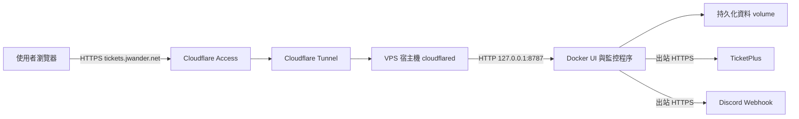

# VPS 上線準備與 DNS 設計

[文件索引](README.md) · [部署與資料搬移](vps-migration.md) · [維運指南](operations.md)

設計日期：2026-10-06。已確認 VPS 為 x86_64、約 2 GB RAM，Docker Compose 可用，`cloudflared-admin` 正在運作，8787 尚未使用。使用者選擇 `tickets.jwander.net` 與空白控制台。部署工具已在本機準備；GitHub 發布、VPS 上線與 Cloudflare 連線仍待驗收。實際操作見 [初次設定指南](vps-setup.md)。

## 建議架構

VPS 使用 `compose.vps.yaml` 與固定 `ticket-watcher-ui-data` volume，由同一個 UI 程序管理查票與通知；本機仍使用 `compose.ui.yaml`。`cloudflared` 以 VPS 宿主機服務常駐，優先沿用該 VPS 既有 Tunnel；新建時採遠端管理的 Named Tunnel。無需新增反向代理。



Tunnel 僅提供控制台入口。查票與 Discord 通知由 VPS 直接出站；Tunnel 暫時斷線時，監控仍可繼續。單台 VPS 是本方案的單點故障，增加同機 connector 不會解決宿主機停機。

## DNS 與 PORT 對照

| 項目 | 建議值 | 說明 |
| --- | --- | --- |
| 正式入口 | `tickets.jwander.net` | 單層子網域、容易記憶，搬 VPS 時不需改網址 |
| 測試入口（有需要才建立） | `tickets-staging.jwander.net` | 獨立 Access app、服務 PORT 與資料 volume；避免重複監控 |
| 新建 Tunnel 名稱 | `vps-01-services` | 按宿主機命名，同一 Tunnel 可承載其他服務 |
| Access application 名稱 | `Ticket Watcher` | 精確保護正式 hostname 的所有路徑 |
| DNS 類型／名稱 | `CNAME` / `tickets` | Cloudflare 完整 DNS 託管情境 |
| DNS 目標 | `<實際 Tunnel UUID>.cfargotunnel.com` | 代理啟用；不是 VPS IP，也不是 Tunnel 顯示名稱 |
| Tunnel Service URL | `http://127.0.0.1:8787` | 假設 connector 位於同一 VPS 宿主機 |
| Docker 發布 PORT | `127.0.0.1:8787:8787` | 現有 Compose 已設定，只允許宿主機本地存取 |
| 應用公開 origin | `https://tickets.jwander.net` | `TICKET_WATCHER_PUBLIC_ORIGIN`，不加 `:8787` 或子路徑 |

使用 Cloudflare 完整 DNS 託管時，Dashboard 新增 published application route 會建立相應 DNS 記錄；完成後讀回確認，不再建立同名 A／AAAA 記錄。DNS 不承載 origin PORT，瀏覽器走 HTTPS 443，8787 只在 VPS 內使用。[官方 DNS 與路由說明](https://developers.cloudflare.com/cloudflare-one/networks/connectors/cloudflare-tunnel/routing-to-tunnel/)

採單層 `tickets.jwander.net`，避免多層 hostname 額外的憑證配置需求。[官方 hostname 說明](https://developers.cloudflare.com/learning-paths/clientless-access/connect-private-applications/create-tunnel/)

若 `cloudflared` 已在容器中，需先重新確認網路拓撲：容器內的 `127.0.0.1` 指向該容器。可另設專用 Docker network，用 `http://ticket-watcher-ui:8787` 連線，但那是另一種部署配置；不可直接照抄宿主機 Service URL。

## 上線前提

- VPS 已有 Docker Engine 與 Compose plugin，部署帳號可管理容器；確認 8787 未被其他服務占用。
- 固定專案目錄與 Compose project name，後續維運使用相同值；預設 named volume 名稱受 project name 影響，隨意改目錄或 `-p` 可能連到空白 volume。
- 起始沿用 CPU `0.50`、記憶體 `256m`、PIDs `64` 上限，部署後實測調整；VPS 規格與其他服務用量仍待確認。
- 可解析 DNS、連出 TicketPlus／Discord HTTPS；Tunnel 出站允許 TCP／UDP 7844，入站不開 8787。SSH 保留既有管理方式，無需為此 UI 新開 VPS 入站 80／443。[Tunnel 連線檢查](https://developers.cloudflare.com/cloudflare-one/networks/connectors/cloudflare-tunnel/troubleshoot-tunnels/connectivity-prechecks/)
- 選定正式 hostname、登入帳號與 Access 身分提供者；確認同名 DNS 與既有 Access policy 沒有衝突。
- Tunnel token／credentials、`.env`、Webhook JSON 及備份私下保存；不放 Git，備份建議加密保存於另一台主機。

## 執行順序

### 1. 準備可重現版本與資料

本次從空白控制台開始，初次部署保持全域暫停，沒有目標或 Webhook；不會搬移或停止本機監控。未來若改為搬移既有資料，再依 [搬移指南](vps-migration.md#本機-ui-資料搬移) 停止本機寫入、匯出並私下傳送；切換後避免兩端重複監控同一目標。

若要先測試 VPS UI，使用空白且目標停用的獨立資料，正式還原時換回正式 volume。只啟動 UI 服務，不同時啟動 CLI `run`。正式還原後先保持 `app.ui_paused: true`，驗收完成才從 UI 恢復；保留原本每個目標的 enabled 狀態。

### 2. 設定 Access，再設定 Tunnel 路由

1. 建立 self-hosted Access app，hostname 為 `tickets.jwander.net`，Path 留空以涵蓋全部路徑。
2. Allow policy 僅包含自己的登入帳號；不要加入 Everyone 或 Bypass。瀏覽器登入期限可先設 8 小時。
3. 確認 VPS 上 connector 的位置與服務自動啟動設定。已有健康 Tunnel 時新增一條路由即可；不要覆蓋其他服務設定。
4. 新增 published application route：正式 hostname → HTTP → `127.0.0.1:8787`。
5. 啟用 **Protect with Access**，指定此 app 的 team name 與 AUD，讓 cloudflared 驗證 JWT。保留公開 Host，不將 HTTP Host Header 改寫成 localhost。
6. 讀回 DNS：名稱、Tunnel UUID 與代理狀態符合上表。

先建立 Access，才能避免路由建立後控制台無登入保護；origin JWT 驗證依官方要求由 cloudflared 執行。本應用的公開 origin 白名單並不驗證登入身分。[官方 Access 建置與 JWT 驗證](https://developers.cloudflare.com/cloudflare-one/access-controls/applications/http-apps/self-hosted-public-app/)、[origin Access 參數](https://developers.cloudflare.com/cloudflare-one/networks/connectors/cloudflare-tunnel/configure-tunnels/origin-parameters/#access)

本機管理 Tunnel 的 ingress 範例位於 [既有部署指南](vps-migration.md#cloudflare-tunnel--access)。遠端管理 Tunnel 在 Dashboard 設定，不另外建立互相競爭的本機 ingress。

### 3. 設定應用入口並啟動

專案 `.env` 加入以下設定；Webhook 依既有 UI JSON 或環境變數來源搬移：

```dotenv
TICKET_WATCHER_PUBLIC_ORIGIN=https://tickets.jwander.net
TICKET_WATCHER_CPUS=0.50
TICKET_WATCHER_MEMORY=256m
TICKET_WATCHER_PIDS=64
```

首次部署透過 [GitHub 設定流程](vps-setup.md#6-開啟自動更新與首次部署) 發布測試映像，再使用受限 SSH 入口啟動，不在 VPS 建置程式。部署腳本會執行容器健康與本地 HTTP 驗收。

`TICKET_WATCHER_PUBLIC_ORIGIN` 修改後，需重新建立容器才能帶入新環境值；單純 restart 不會更新環境。程序健康不代表 Access、票網或 Discord 已驗收。

## 上線驗收

下列項目皆待部署環境驗收，完成時記錄時間、版本與結果：

- [ ] DNS 指向正確 Tunnel，TLS 憑證有效；無須在網址加 8787。
- [ ] 未登入瀏覽器存取首頁及 `/api/state` 會被 Access 攔截，不能讀取控制台資料。
- [ ] 非允許帳號無法存取；自己的帳號登入後可載入控制台、儲存設定，沒有 Host／Origin／CSRF 錯誤。
- [ ] Protect with Access 已啟用並指向正確 AUD；檢查沒有其他公開路由繞過同一 origin 的保護。
- [ ] VPS 公網 IP 的 8787（IPv4／IPv6）不可直接連線；宿主機 `127.0.0.1:8787` 可用。
- [ ] 原監控目標、頻道、票況基準及暫停狀態相符，本機服務保持停止。
- [ ] 從 UI 恢復後，VPS 能查票並寫入紀錄；以一次明確的測試通知驗證 Discord，待送狀態不能當成送達。
- [ ] 重啟 UI 後設定與資料保留；維護時段重啟 VPS，Docker／UI／cloudflared 自動恢復。
- [ ] 觀察 CPU、記憶體、重啟次數與日誌；heartbeat 健康、未出現 OOM 或重複通知。
- [ ] 完成一次私有備份與獨立 volume 還原驗證，不用正式 volume 做覆寫測試。

控制台回應已設定 `Cache-Control: no-store`。若網域已有強制快取規則，為正式 hostname 設定 Cache Bypass，避免覆蓋應用的禁止快取要求。

## 維運與回復

上線後先觀察一個完整監控週期及 24 小時資源用量，再決定是否調整限制。Compose 的 `restart: unless-stopped` 會在程序退出時重啟；`unhealthy` 標記本身不會觸發自動重啟，需維運檢查。Tunnel 狀態、UI heartbeat、平台查詢與 Discord 送達分開確認。

每日備份及升級前備份，採停止 UI 後完整複製資料目錄的方法，保留最近 7 份每日備份及最近一次升級前版本。短暫停止期間無法查票，應安排維護窗口；具體命令沿用搬移指南，另行安全保存宿主機 `.env`。更新前記錄 Git commit，先建置新映像，再停止服務與備份。

入口出問題時先移除或停用此 hostname 的 Tunnel 路由，保留 Access policy；可用 [SSH tunnel](vps-migration.md#ssh-tunnel) 管理 UI，監控不需因此停止。不要刪除共用 Tunnel。

程式或資料出問題時停止 VPS UI，再用先前程式版本及對應的升級前資料備份回復；不要讓舊版程式直接讀已升級的 DB。若回到本機執行，先確認 VPS 已停止，再恢復本機。回復到舊備份可能遺失新基準與通知紀錄，需比對，避免重複通知。任何回復流程都不使用 `down --volumes`。

## GitHub 推送自動更新 VPS

[Tests workflow](../.github/workflows/tests.yml) 已加入 publish 與 deploy jobs，設定步驟見 [初次設定指南](vps-setup.md)。目前仍在本機，未提交或推送。


- GitHub-hosted runner 負責建置 Linux amd64 映像，VPS 不做建置；映像使用該 run 的 commit SHA 標籤與固定 digest，部署前核對映像 revision label。
- main push 才發布。repository variable `VPS_DEPLOY_ENABLED=true` 才部署，部署 job 引用 `production` Environment Secrets；PR 和其他分支不取得部署憑證。
- 金鑰只允許固定 root 管理的部署入口，不能由 CI 修改部署腳本或傳入任意映像來源。SSH 嚴格核對已信任的 host key。[GitHub Actions 安全建議](https://docs.github.com/en/actions/reference/security/secure-use)
- GitHub concurrency 不取消進行中的部署，VPS `flock` 另行防止並發；記錄已開始部署的 workflow run number，過時 run 不可覆蓋新版本。SSH 中斷後由 VPS systemd 繼續執行，最長 15 分鐘。[GitHub concurrency 說明](https://docs.github.com/en/actions/how-tos/deploy/configure-and-manage-deployments/control-deployments)
- 先 pull／核對 schema，再停止 UI。備份全 volume 後，離線修改全域暫停欄位，以暫停模式啟動驗收；成功後恢復原本 paused 值，保留 enabled、Webhook、基準與待送紀錄。
- 比較 SQLite user_version 與 schema 完整簽章，不允許自動結構遷移。失敗時只有 schema 相容才恢復先前映像；保留當前 DB，不自動倒退通知紀錄。首次部署沒有舊映像時失敗保持停止。
- 固定 project name `ticket-watcher`，volume `ticket-watcher-ui-data`。既有 Bot 的部署金鑰、Compose 與資料不共用。
- UI 使用 `tickets.jwander.net` 的 HTTP Tunnel；GitHub runner 沿用既有 VPS SSH TCP 22，無須新增 SSH Tunnel hostname。
- GitHub 端發布權限為 `packages: write`；私有 GHCR 的 VPS read-packages 憑證留在 root Docker 設定。是否把純程式 package 設為 public 另外由使用者決定。

檔案：[compose.vps.yaml](../compose.vps.yaml)、[受限部署入口](../scripts/deploy-vps.sh)、[離線資料準備](../scripts/deploy_state.py)、[入口安裝器](../scripts/install-vps-deploy.sh)。這些工具準備完成不代表 Secrets、GHCR 發布、Tunnel policy 或真實部署已完成。

### 自動更新驗收

- [ ] main push 的成功部署 SHA 等於全矩陣測試 SHA，映像以固定 digest 下載。
- [ ] PR、其他分支、CI 失敗與未開啟部署開關的 run 不部署。
- [ ] Secrets 從此 repo 的 production Environment 注入；日誌不輸出私密設定。
- [ ] 連續推送與人工部署受鎖保護；舊 run 不覆蓋新版本。
- [ ] registry／revision／schema 預檢失敗不停止正式服務；健康失敗會回報並依相容性回復。
- [ ] 更新仍使用固定 volume；保留原 paused 狀態，沒有雙程序查票。
- [ ] SSH 中斷後檢查 VPS systemd 最終結果，再決定是否重跑。

## 正式部署前仍需填入

| 決策 | 目前值 |
| --- | --- |
| Cloudflare zone／正式 hostname | `jwander.net`／`tickets.jwander.net`，帳戶路由與 policy 待設定 |
| VPS 主機／資源／部署目錄 | 既有 Ubuntu VPS、x86_64、約 2 GB RAM／`/opt/ticket-watcher` |
| Tunnel 是否沿用／connector 位置 | 沿用宿主機 `cloudflared-admin`；帳戶管理方式待確認 |
| Access 允許登入帳號／IdP | 待確認 |
| 自動更新 SSH 路徑／部署帳號 | GitHub-hosted runner → 既有 TCP 22／ubuntu 受限專用金鑰，待設定 |
| 上線 commit／備份保存位置／切換時段 | 待確認 |

這些資料確認後，才能把範例值替換成正式設定並執行環境驗收。
